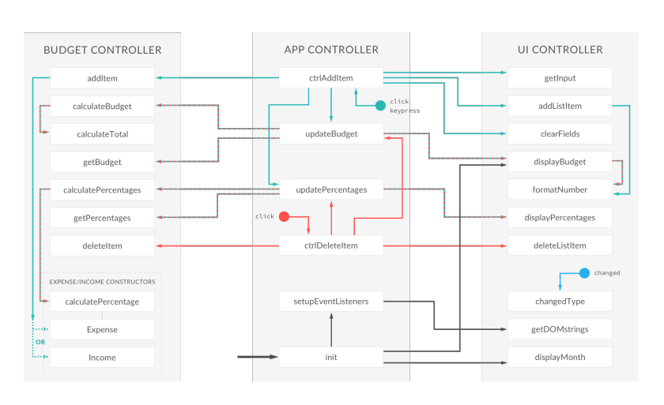

# Budget-app-JS

## Live Demo
https://jvjplus.github.io/Budgety/

## Technologies
* HTML5
* CSS3
* Vanilla JavaScript

## General info
This is a budgeting app that calculates a budget based on a list of income and expenses.
App was created as part of [Jonas Schmedtmann's JavaScript course on Udemy](https://www.udemy.com/the-complete-javascript-course/learn/v4/overview).
This section of the course teaches about module pattern and IIFEs.

The HTML and CSS code involved in this project were pre-written by Mr. Schmedtmann.

We had to write the JS code after watching the videos.

## Pleaned features
* Add time when added to list
* Option to edit description
* Undo Option when delete some list item
* Mini-FLoating Calculator can be added.
* Add a button to clear all incomes and/or expenses
* Use ES6 standards as much as possible
* Add webpack in it, and separate all the modules

